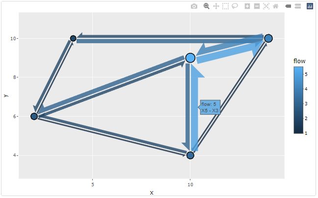

<!-- README.md is generated from README.Rmd. Please edit that file -->

```{r, include = FALSE}
knitr::opts_chunk$set(
  collapse = TRUE,
  comment = "#>",
  fig.path = "man/figures/README-",
  out.width = "70%",
  dpi=300
  # fig.width=7
)
```

# flowmapper

flowmapper allows to create ggplots with flowmaps in the style of <https://flowmap.gl/>.

## Installation

You can install the development version of flowmapper like so:

``` r
devtools::install_github("https://github.com/JohMast/flowmapper")
```

## Example

flowmapper uses a single function `add_flowmap` to add a flowmap layer to an existing ggplot. `add_flowmap` requires as inputs a single data.frame (or tibble) that contains for every combination of two nodes a and b

-   the x and y coordinates of each these nodes,

-   a unique id for each of these nodes,

-   the intensity of flow between those nodes in both directions (from a to b, and from b to a).

The data.frame should have the following columns:

```{r example}

testdata <-
data.frame(
   id_a = c("X1","X2","X3","X3","X1","X2","X2"),
   id_b = c("X5","X4","X1","X5","X4","X5","X3"),
   xa = c(2,14,10,10,2,14,14),
   ya = c(6,10,9,9,6,10,10),
   xb = c(10,4,2,10,4,10,10),
   yb = c(4,10,6,4,10,4,9),
   flow_ab = c(1,2,3,3,1,1,4),
   flow_ba = c(2,3,2,5,2,1,5)
)

```

The dataframe and the ggplot that the flowmap should be added to are then passed into `add_flowmap`.

```{r c2, warning=FALSE}
library(ggplot2)
plot <- ggplot() # empty ggplot

library(flowmapper)
plot |>
  add_flowmap(testdata)+
  coord_equal()  # coord equal is highly recommended to create symmetric shapes
```

Transparency and outline of the arrows can be controlled with the `outline_col` and `alpha` arguments.

```{r c3}
plot |>
  add_flowmap(testdata, outline_col = "orange", alpha=0.5)+
  coord_equal()  # coord equal is highly recommended to create symmetric shapes
```

The flow arrows are geom_polygons, with the flow mapped to the fill aesthetic. Thus, the fill can be adjusted like for any geom.

```{r c4}
plot |>
  add_flowmap(testdata)+
  coord_equal() + 
  scale_fill_gradient(low="black", high = "red")
```

Size of the edges and offset (distance between two paired edges) can be controlled with `edge_width_factor` and `edge_offset_factor` .

```{r c5}
plot |>
  add_flowmap(testdata, edge_offset_factor = 4, edge_width_factor = 2)+
  coord_equal()
```

Finally, the size of the nodes can be adjusted with `node_radius_factor`, and the distance between nodes and edges with `node_buffer_factor`.

```{r}

plot |>
  add_flowmap(testdata, node_radius_factor = 2, node_buffer_factor = 0.5)+
  coord_equal()
```

Because the edges are polygons and not linked to an aesthetic, a typical ggplot legend cannot be created for their width. As an alternative, a legend can be added to the bottom of the main panel by using `add_legend` and `legend_col`.

```{r}
plot |>
  add_flowmap(testdata,add_legend = "bottom",legend_col = "gray20")+
  coord_equal()
```

If the number of nodes is very high, the plot will appear cluttered. In that case, nodes can be clustered and merged by proximity, with `k_nodes` controlling the number of clusters.

```{r}
plot |>
  add_flowmap(testdata,k_nodes = 4)+
  coord_equal()
```

The flowmap can be turned into an interactive plot using the [plotly](https://github.com/plotly/plotly.R) library. The names of the nodes and flows are mapped to the `text` aesthetic and can be used in the tooltips.

```{r eval=FALSE, include=TRUE}
library(plotly)
plot <- 
  plot |>
  add_flowmap(testdata)+
  coord_equal()
ggplotly(plot,tooltip = c("text","fill"))
```


