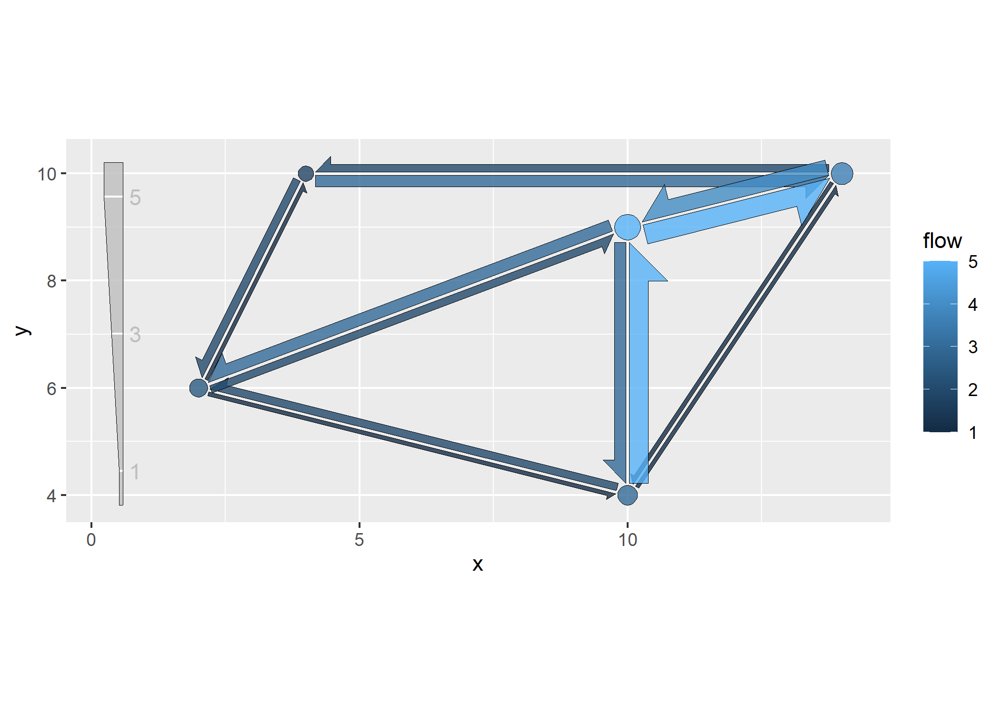
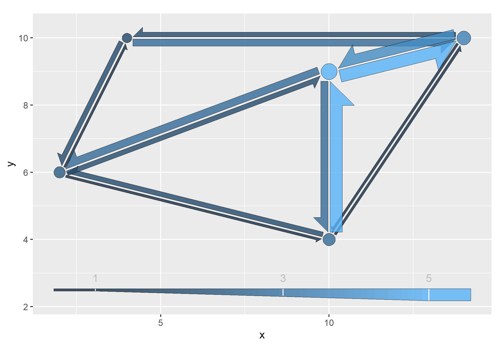
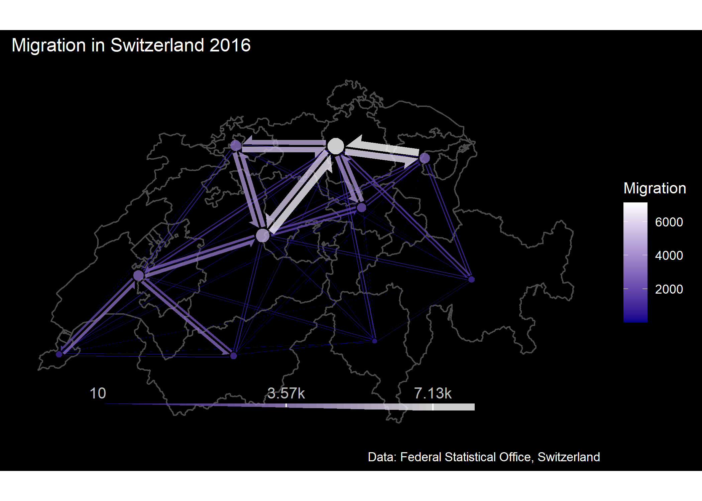

[](https://CRAN.R-project.org/package=flowmapper)
<!-- [](https://CRAN.R-project.org/package=flowmapper) -->

# flowmapper

flowmapper allows to create ggplots with flowmaps in the style of
<https://flowmap.gl/>.

## Installation

You can install the released version of flowmapper from CRAN:

``` r
install.packages("flowmapper")
```

Or, you can install the development version of flowmapper like so:

``` r
devtools::install_github("https://github.com/JohMast/flowmapper")
```

## Details

flowmapper uses a single function `add_flowmap` to add a flowmap layer
to an existing ggplot. `add_flowmap` requires as inputs a single
data.frame (or tibble) that contains for every combination of two nodes
a and b

- the x and y coordinates of each these nodes,

- a unique id for each of these nodes,

- the intensity of flow between those nodes in both directions (from a
  to b, and from b to a).

The data.frame should have the following columns:

``` r

testdata <-
data.frame(
   id_a = c("X1","X2","X3","X3","X1","X2","X2"),
   id_b = c("X5","X4","X1","X5","X4","X5","X3"),
   xa = c(2,14,10,10,2,14,14),
   ya = c(6,10,9,9,6,10,10),
   xb = c(10,4,2,10,4,10,10),
   yb = c(4,10,6,4,10,4,9),
   flow_ab = c(1,2,3,3,1,1,4),
   flow_ba = c(2,3,2,5,2,1,5)
)
```

The dataframe and the ggplot that the flowmap should be added to are
then passed into `add_flowmap`.

``` r
library(ggplot2)
plot <- ggplot() # empty ggplot

library(flowmapper)
plot |>
  add_flowmap(testdata)+
  coord_equal()  # coord equal is highly recommended to create symmetric shapes
```


If the number of nodes is very high, the plot will appear cluttered. In
that case, nodes can be clustered and merged by proximity, with
`k_nodes` controlling the number of clusters.

``` r
plot |>
  add_flowmap(testdata,k_nodes = 4)+
  coord_equal()
```


Transparency and outline of the arrows can be controlled with the
`outline_col` and `alpha` arguments.

``` r
plot |>
  add_flowmap(testdata, outline_col = "orange", alpha=0.5)+
  coord_equal()  # coord equal is highly recommended to create symmetric shapes
```


The flow arrows are geom_polygons, with the flow mapped to the fill
aesthetic. Thus, the fill can be adjusted like for any geom.

``` r
plot |>
  add_flowmap(testdata)+
  coord_equal() + 
  scale_fill_gradient(low="black", high = "red")
```


Size of the edges and offset (distance between two paired edges) can be
controlled with `edge_width_factor` and `edge_offset_factor` .

``` r
plot |>
  add_flowmap(testdata, edge_offset_factor = 4, edge_width_factor = 2)+
  coord_equal()
```


Finally, the size of the nodes can be adjusted with
`node_radius_factor`, and the distance between nodes and edges with
`node_buffer_factor`.

``` r

plot |>
  add_flowmap(testdata, node_radius_factor = 2, node_buffer_factor = 0.5)+
  coord_equal()
```


Because the edges are polygons and not linked to an aesthetic, a typical
ggplot legend cannot be created for their width. As an alternative, a
legend can be added to the bottom of the main panel by using
`add_legend`.

``` r
undebug(add_flowmap)
plot |>
  add_flowmap(testdata,add_legend = "left")+
  coord_equal()
```



Instead of a monotone legend, the legend color can be set to represent
the flow intensity with `legend_gradient`.

``` r
# debug(add_flowmap)
plot |>
  add_flowmap(testdata, add_legend = "bottom",legend_gradient=T)+
  coord_equal()+
  theme(legend.position = "none")
```



The flowmap can be turned into an interactive plot using the
[plotly](https://github.com/plotly/plotly.R) library. The names of the
nodes and flows are mapped to the `text` aesthetic and can be used in
the tooltips.

``` r
library(plotly)
plot <- 
  plot |>
  add_flowmap(testdata)+
  coord_equal()
ggplotly(plot,tooltip = c("text","fill"))
```


## Example

The code below shows an example of real world data from Switzerland
(same data used in
[this](https://www.flowmap.blue/15kwLB4baXZ7jpip8q0JjgR6zDoS5Gt3gMLCTUAboQxk?v=46.719075,7.817990,7.51&a=0&d=1&c=0&lt=1&col=Default&f=45)
flowmap). The data contains migration flows between the 26 Cantons of
Switzerland.

``` r
library(dplyr,warn.conflicts = FALSE)
library(ggplot2,warn.conflicts = FALSE)
library(sf)
library(flowmapper)

# load migration data
data <-
  flowmapper::CH_migration_data
head(data)
#> # A tibble: 6 × 8
#>   id_a   id_b      flow_ab      xa       ya      xb       yb flow_ba
#>   <chr>  <chr>       <dbl>   <dbl>    <dbl>   <dbl>    <dbl>   <dbl>
#> 1 Zurich Bern         1673 963578. 6010540. 848945. 5913828.    2097
#> 2 Zurich Lucerne      1017 963578. 6010540. 903672. 5953394.    1530
#> 3 Zurich Uri            84 963578. 6010540. 960416. 5905545.     110
#> 4 Zurich Schwyz       1704 963578. 6010540. 975336. 5952572.    1428
#> 5 Zurich Obwalden       70 963578. 6010540. 917705. 5918015.     107
#> 6 Zurich Nidwalden      94 963578. 6010540. 936303. 5930028.     132
```

As a background for the flow map, a ggplot is created using the
administrative boundaries, sourced from the
[GADM](https://gadm.org/index.html) dataset.

``` r
cantons <- flowmapper::cantons
st_crs(cantons) <- 3857

# basic plot with just the admin units
p <- ggplot(cantons)+
  geom_sf(fill=NA,col="gray30",linewidth=0.5) +
  ggdark::dark_theme_bw()+
  theme(panel.border = element_blank(),
        axis.title = element_blank(),
        axis.text = element_blank(),
        axis.ticks = element_blank())+
  labs(title = "Migration in Switzerland 2016",
       caption = "Data: Federal Statistical Office, Switzerland")
p
```


The flowmap is then added to the base plot by using `add_flowmap`,
applying some clustering to reduce the number of nodes from 26 to 10. A
custom color scale is applied which matches the dark background.

``` r
p2 <-
  p|>
  add_flowmap(flowdat = data,
              add_legend = "bottom",
              edge_width_factor = 0.7,
              k_nodes = 10,legend_gradient=T,
              outline_col = NA)+
  theme(panel.grid = element_blank())+
  scale_fill_gradient("Migration",
                      low = "darkblue",
                      high="white")
p2
```



The flowmap uses the *color* and *fill* aesthetics, which can be
limiting when the ggplot also should contain other layers using the same
aesthetic. In such cases, the
[ggnewscale](https://eliocamp.github.io/ggnewscale/) package can be used
to enable a new scale for those aesthetics. The following example shows
a flowmap being added to a basemap from the
[basemaps](https://jakob.schwalb-willmann.de/basemaps/) package, which
itself uses the *fill* aesthetic.

``` r
library(basemaps)

p <- basemap_ggplot(cantons,
                    map_service = "esri",
                    map_type = "world_hillshade",
                    alpha=0.3)+
  theme_bw()+
  theme(
    axis.title = element_blank(),
    axis.text = element_blank(),
    axis.ticks = element_blank())+
  scale_x_continuous(expand = expansion(0,0))+
  scale_y_continuous(expand = expansion(0,0))+
  ggnewscale::new_scale_fill()+
  labs(title = "Migration in Switzerland 2016",
       caption = "Data: Federal Statistical Office, Switzerland")
#> Loading basemap 'world_hillshade' from map service 'esri'...

p|>
  add_flowmap(flowdat = data,
              edge_width_factor = 0.7,k_nodes = 10,
              outline_col = NA)+
  theme(panel.grid = element_blank())+
  scale_fill_gradient("Migration",low = "gray",high="red")
```


## Export as Simple Feature objects

Finally, it may be desirable to receive the edges and nodes as spatial
objects. This way, they can be used for visualisations in other
geospatial software.

To achieve this, the `flowmap_sf` function can be used. This function
creates a list of two [sf](https://r-spatial.github.io/sf/) objects, one
for the edges and one for the nodes.

``` r
sf_objects <- 
  flowmap_sf(
  flowdat = data,
  edge_width_factor = 0.7,
  k_nodes = 10,
  crs=3857
)

sf_edges <- sf_objects$edges
sf_nodes <- sf_objects$nodes

sf_edges
#> Simple feature collection with 90 features and 3 fields
#> Geometry type: POLYGON
#> Dimension:     XY
#> Bounding box:  xmin: 684313.7 ymin: 5812539 xmax: 1072488 ymax: 6023863
#> Projected CRS: WGS 84 / Pseudo-Mercator
#> First 10 features:
#>                        orig                                 dest flow
#> 1  Graubunden and 0 others.                 Geneve and 0 others.   12
#> 2  Graubunden and 0 others.                 Geneve and 0 others.   10
#> 3      Geneve and 0 others. Appenzell Ausserrhoden and 3 others.   33
#> 4      Geneve and 0 others. Appenzell Ausserrhoden and 3 others.   56
#> 5      Valais and 0 others.             Graubunden and 0 others.   49
#> 6      Valais and 0 others.             Graubunden and 0 others.   42
#> 7  Graubunden and 0 others.               Fribourg and 2 others.   59
#> 8  Graubunden and 0 others.               Fribourg and 2 others.   65
#> 9      Valais and 0 others.                 Ticino and 0 others.   66
#> 10     Valais and 0 others.                 Ticino and 0 others.   88
#>                          geometry
#> 1  POLYGON ((1068217 5886897, ...
#> 2  POLYGON ((686465.8 5815525,...
#> 3  POLYGON ((686384.9 5816675,...
#> 4  POLYGON ((1021820 5999137, ...
#> 5  POLYGON ((851336.2 5814705,...
#> 6  POLYGON ((1068208 5886407, ...
#> 7  POLYGON ((1068345 5887602, ...
#> 8  POLYGON ((763681.9 5889299,...
#> 9  POLYGON ((851304.4 5813882,...
#> 10 POLYGON ((977638.3 5829046,...
sf_nodes
#> Simple feature collection with 10 features and 2 fields
#> Geometry type: POLYGON
#> Dimension:     XY
#> Bounding box:  xmin: 679809.4 ymin: 5811219 xmax: 1074959 ymax: 6020274
#> Projected CRS: WGS 84 / Pseudo-Mercator
#>                                    name flowsum                       geometry
#> 1                  Aargau and 2 others.   52643 POLYGON ((951549.9 6012490,...
#> 2  Appenzell Ausserrhoden and 3 others.   21675 POLYGON ((1032554 6001117, ...
#> 3        Basel-Landschaft and 3 others.   23473 POLYGON ((854526.7 6013068,...
#> 4                    Bern and 3 others.   36167 POLYGON ((881237.2 5928035,...
#> 5                Fribourg and 2 others.   21884 POLYGON ((762690.3 5890344,...
#> 6                  Geneve and 0 others.    7679 POLYGON ((685754.8 5815844,...
#> 7                  Glarus and 3 others.   16455 POLYGON ((972571.5 5954447,...
#> 8              Graubunden and 0 others.    7884 POLYGON ((1074959 5886586, ...
#> 9                  Ticino and 0 others.    4756 POLYGON ((982871 5828370, 9...
#> 10                 Valais and 0 others.    9056 POLYGON ((850578.6 5814447,...
```

These objects can then be exported using `st_write`.

``` r
sf::st_write(sf_nodes, "sf_nodes.gpkg", delete_dsn = TRUE)
sf::st_write(sf_edges, "sf_edges.gpkg", delete_dsn = TRUE)
```
